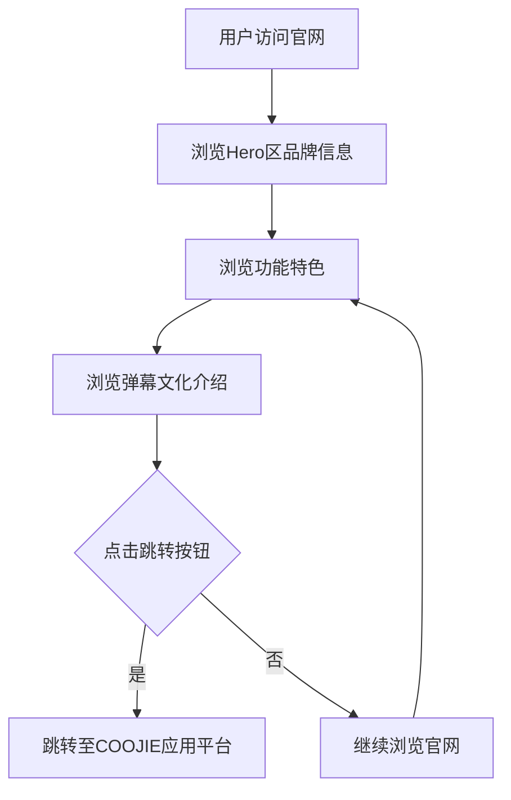

## 1. 产品概述

COOJIE弹幕视频网官网是一个品牌展示型单页网站，旨在向用户展示COOJIE弹幕视频平台的核心价值与特色功能，引导用户点击按钮跳转至实际应用平台。
- 目标用户：热爱弹幕互动、视频内容的年轻用户群体
- 核心目标：品牌形象展示 + 用户引流至应用平台

## 2. 核心功能

### 2.1 用户角色

| 角色 | 注册方式 | 核心权限 |
|------|----------|----------|
| 访客 | 无需注册 | 浏览官网信息，点击跳转至应用 |

### 2.2 功能模块

1. **首页**：品牌Hero区、功能特色展示、弹幕文化介绍、用户引导跳转

### 2.3 页面详情

| 页面名称 | 模块名称 | 功能描述 |
|----------|----------|----------|
| 首页 | Hero区 | 品牌Logo、Slogan、动态弹幕背景效果、跳转按钮 |
| 首页 | 功能特色 | 展示弹幕互动、视频播放、社区交流等核心功能 |
| 首页 | 弹幕文化 | 介绍弹幕文化魅力与COOJIE的独特之处 |
| 首页 | 页脚 | 版权信息、社交链接 |

## 3. 核心流程

用户访问官网 → 浏览品牌信息与功能介绍 → 点击跳转按钮 → 进入COOJIE应用平台

## 4. 用户界面设计

### 4.1 设计风格

- 主色调：深色系（#0a0a1a 暗夜蓝黑）+ 霓虹青绿（#00ffc8）作为强调色
- 辅助色：电光紫（#8b5cf6）、热力橙（#ff6b35）
- 按钮风格：圆角胶囊按钮，霓虹发光效果，hover时脉冲动画
- 字体：标题使用粗体无衬线字体，正文使用轻量无衬线字体
- 布局风格：全屏沉浸式区块，垂直滚动，弹幕元素漂浮动画
- 图标风格：线性图标，霓虹发光效果
- 整体风格：赛博朋克/霓虹风格，契合弹幕视频的潮流感

### 4.2 页面设计概览

| 页面名称 | 模块名称 | UI元素 |
|----------|----------|--------|
| 首页 | Hero区 | 全屏背景、动态弹幕漂浮效果、大标题Logo、Slogan、发光跳转按钮 |
| 首页 | 功能特色 | 三列卡片布局、图标+文字、hover发光效果 |
| 首页 | 弹幕文化 | 左文右图布局、渐变背景分隔 |
| 首页 | 页脚 | 深色背景、版权文字、社交图标 |

### 4.3 响应式设计

- 桌面优先设计，移动端自适应
- 移动端功能特色卡片改为单列堆叠
- 触摸优化：按钮最小点击区域44px

### 4.4 动效设计

- 弹幕文字从右向左持续漂浮
- 页面滚动时元素淡入动画
- 按钮hover脉冲发光效果
- 背景微光粒子效果
