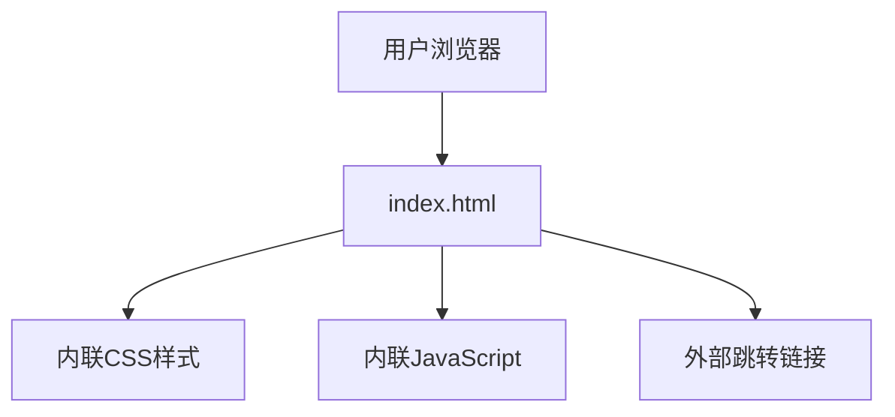

## 1. 架构设计

纯前端静态网站，无后端服务。

## 2. 技术说明

- 前端：纯HTML + CSS + JavaScript（单文件方案）
- 构建工具：无（直接部署静态HTML）
- 后端：无
- 数据库：无

## 3. 路由定义

| 路由 | 用途 |
|------|------|
| / | 官网首页，包含所有内容区块 |

## 4. 外部依赖

| 依赖 | 用途 | 引入方式 |
|------|------|----------|
| Google Fonts | 字体加载 | CDN link |
| 无其他依赖 | - | - |

## 5. 关键交互

| 交互元素 | 行为 |
|----------|------|
| 跳转按钮 | 点击后在新标签页打开 `https://app-by24i5n3kgld.appmiaoda.com/` |
| 弹幕动画 | CSS动画驱动，文字从右向左漂浮 |
| 滚动动画 | IntersectionObserver监听，元素进入视口时淡入 |
| 按钮悬停 | CSS hover效果，脉冲发光 |
